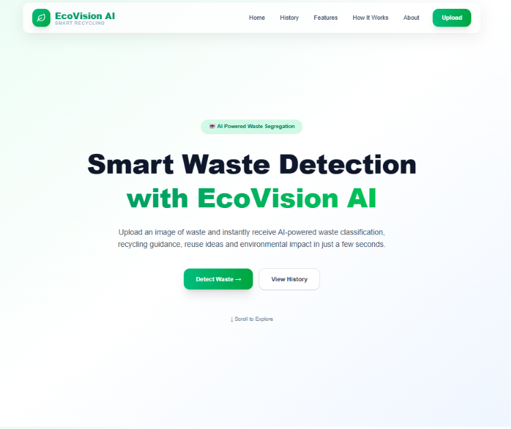
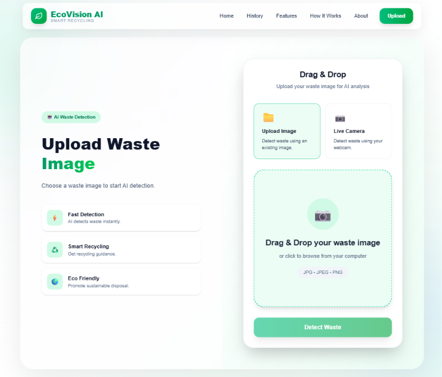
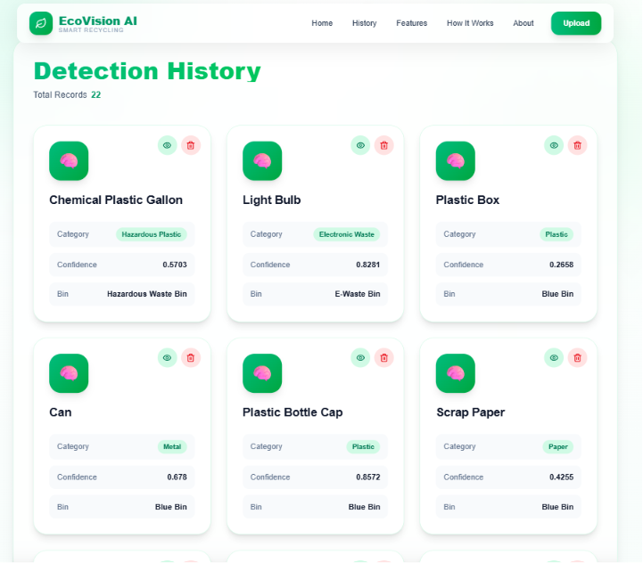
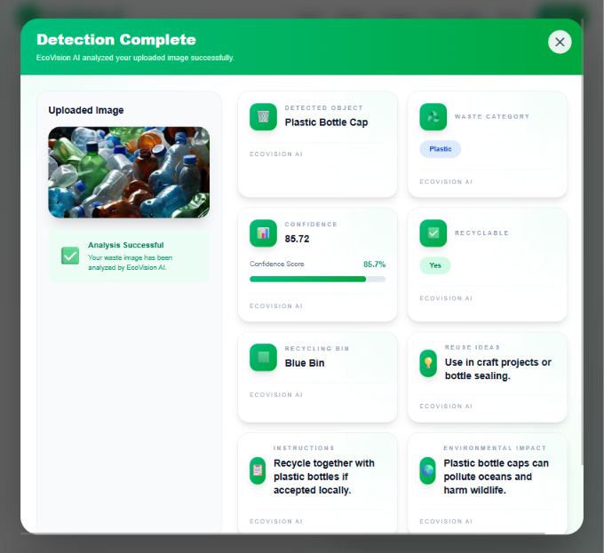

# 🌍 EcoVision AI

<div align="center">

# ♻️ AI-Powered Smart Waste Detection & Recycling Assistant

### Identify Waste • Get Recycling Guidance • Build a Greener Future

<br>


---

### 🌱 Making Waste Segregation Smarter with Artificial Intelligence

An intelligent web application that uses **Artificial Intelligence** to identify waste materials and provide instant recycling guidance, helping users make environmentally responsible disposal decisions.

</div>

---

# 📖 Project Overview

**EcoVision AI** is an AI-powered web application developed during a Hackathon to simplify waste segregation using Computer Vision.

Instead of guessing where waste should be disposed, users can simply:

- 📁 Upload an existing image
- 📷 Capture a live photo using their camera

The application analyzes the image using a **custom-trained YOLOv8 object detection model**, identifies the waste item, and instantly provides complete recycling guidance.

For every successful detection, EcoVision AI predicts:

- 🧠 Object Name
- ♻️ Waste Category
- 🎯 AI Confidence Score
- ✅ Recyclable / ❌ Non-Recyclable
- 🗑 Recommended Disposal Bin
- 📚 Recycling Instructions
- 💡 Reuse Ideas
- 🌱 Environmental Impact

Every successful detection is automatically stored in the database and can later be viewed from the **Detection History** page.

---

# 🎯 Problem Statement

Improper waste segregation is one of the biggest contributors to environmental pollution.

Many recyclable materials end up in landfills simply because people don't know how to dispose of them correctly.

EcoVision AI solves this problem by combining **Artificial Intelligence**, **Computer Vision**, and **Web Technologies** to provide instant waste identification and recycling recommendations, making waste management easier, smarter, and more sustainable.

---

# ✨ Features

| 🚀 Feature | 📄 Description |
|------------|----------------|
| 🧠 AI Waste Detection | Detect waste using a custom-trained YOLOv8 AI model. |
| 📁 Upload Image | Upload JPG, JPEG, or PNG images for waste detection. |
| 📷 Live Camera | Detect waste directly using the device camera. |
| 📸 Capture Photo | Capture an image instantly from the live camera. |
| 🔄 Retake Photo | Retake images before performing AI detection. |
| 🎯 Confidence Score | Shows prediction confidence for every detected object. |
| ♻️ Waste Classification | Determines whether the waste is recyclable or non-recyclable. |
| 🗑 Smart Bin Recommendation | Suggests the correct disposal bin. |
| 📚 Recycling Instructions | Provides recycling guidance for the detected waste. |
| 💡 Reuse Ideas | Suggests practical reuse ideas for waste materials. |
| 🌱 Environmental Impact | Explains how improper disposal affects the environment. |
| 🖼 Detection Result Modal | Displays AI prediction in a modern popup modal. |
| 📜 Detection History | Stores previous detections in the database. |
| 🗑 Delete History | Delete unwanted detection records. |
| 📱 Fully Responsive UI | Optimized for Desktop, Laptop, Tablet, and Mobile devices. |
| ⚡ Fast API Communication | React communicates with Django REST APIs using Axios. |
| 🛡 Image Validation | Accepts only valid image formats before prediction. |
| 🚨 Error Handling | Displays meaningful messages during validation or prediction failures. |

---

# 🏗 Tech Stack

## 🎨 Frontend

| Technology | Purpose |
|------------|---------|
| React | User Interface |
| Vite | Build Tool |
| Tailwind CSS | Responsive UI Design |
| Axios | API Communication |
| JavaScript | Frontend Logic |

---

## ⚙️ Backend

| Technology | Purpose |
|------------|---------|
| Python | Programming Language |
| Django | Backend Framework |
| Django REST Framework | REST API Development |

---

## 🤖 Artificial Intelligence

| Technology | Purpose |
|------------|---------|
| YOLOv8 | Object Detection Model |
| Ultralytics | AI Framework |
| OpenCV | Image Processing |
| NumPy | Numerical Operations |
| Pillow | Image Handling |

---

## 🗄 Database

| Technology | Purpose |
|------------|---------|
| SQLite | Detection History Storage |

---

# ⚙️ AI Detection Workflow

```text
                    👤 User
                       │
                       ▼
      📁 Upload Image / 📷 Capture Photo
                       │
                       ▼
              ⚛️ React Frontend
                       │
                       ▼
                 ⚡ Axios API
                       │
                       ▼
          🌐 Django REST Framework
                       │
                       ▼
          🛠 WasteDetectionService
                       │
                       ▼
             🤖 YOLOv8 AI Model
                       │
                       ▼
              🧠 Prediction Mapping
                       │
                       ▼
               🗄 SQLite Database
                       │
                       ▼
           📜 Detection History Saved
                       │
                       ▼
          🖼 Beautiful Detection Modal
```

---

# 📂 Project Structure

```text
EcoVision-AI
│
├── backend
│   ├── apps
│   ├── config
│   ├── media
│   ├── manage.py
│   └── requirements.txt
│
├── frontend
│   ├── public
│   ├── src
│   │   ├── api
│   │   ├── assets
│   │   ├── components
│   │   ├── pages
│   │   ├── services
│   │   ├── App.jsx
│   │   └── main.jsx
│   └── package.json
│
├── screenshots
├── README.md
└── requirements.txt
```

---

# 🌐 API Endpoints

| Method | Endpoint | Description |
|---------|----------|-------------|
| POST | `/api/detect/` | Detect waste from uploaded or captured image |
| GET | `/api/history/` | Retrieve all detection history |
| GET | `/api/history/{id}/` | Retrieve a single detection |
| DELETE | `/api/history/{id}/delete/` | Delete a detection record |

---

# 💻 Installation

## 1️⃣ Clone Repository

```bash
git clone https://github.com/anoodh-ai/EcoVision-AI.git
cd EcoVision-AI
```

## 2️⃣ Backend Setup

```bash
cd backend

python -m venv .venv
```

### Windows

```bash
.venv\Scripts\activate
```

### Linux / macOS

```bash
source .venv/bin/activate
```

Install dependencies

```bash
pip install -r requirements.txt
```

Run migrations

```bash
python manage.py migrate
```

Start backend server

```bash
python manage.py runserver
```

---

## 3️⃣ Frontend Setup

```bash
cd ../frontend

npm install

npm run dev
```

---

# 📸 Screenshots

> Replace the placeholder images below with your actual project screenshots.

---

## 🏠 Home Page

<p align="center">
  
</p>

---

## 📁 Upload Waste Image

<p align="center">
  
</p>

---

## 📷 Live Camera Detection

<p align="center">
  
</p>

---

## 🎯 AI Detection Result

<p align="center">
  
</p>

---

## 📜 Detection History

<p align="center">
  
</p>

---

# 🎥 Project Demo

## 🎬 Demo Video

Watch the complete project demonstration here:

> 🔗 **Demo Video:** *(Add your YouTube or Google Drive video link here.)*

---

## 🌐 GitHub Repository

> 🔗 **Repository:** https://github.com/anoodh-ai/EcoVision-AI

---

# 🚀 Challenges Faced During Development

Developing EcoVision AI involved solving several real-world technical challenges:

- 🔗 Integrating **React** with **Django REST Framework**
- 📤 Sending images securely using **FormData**
- 📷 Building a **Live Camera Capture** feature
- 🎥 Handling browser **Camera Permissions**
- 🤖 Integrating the **YOLOv8 AI Model**
- 🧠 Mapping AI predictions into structured recycling information
- 🗄 Saving prediction history into **SQLite**
- 🖼 Designing a modern **Detection Result Modal**
- 📱 Building a fully responsive UI for all devices
- 🚨 Handling API validation and prediction errors gracefully
- 🖼 Managing uploaded and captured images efficiently
- ⚡ Optimizing frontend and backend communication using Axios

---

# 🔮 Future Improvements

The project can be extended further with the following features:

- ♻️ Support additional waste categories
- 🎯 Improve AI detection accuracy with a larger dataset
- 📷 Enhance live camera prediction quality
- ☁️ Deploy the application online
- 📊 Add analytics and waste statistics dashboard
- 🌍 Support multiple languages
- 📱 Progressive Web App (PWA) support

---

# 👨‍💻 Team

This project was developed during a **Hackathon**.

| Name | Role |
|------|------|
| **Anoodh A** | Full Stack Developer (Frontend • Backend • AI Integration) |

> *(Add more team members if applicable.)*

---

# ❤️ Acknowledgements

Special thanks to the amazing open-source technologies that made this project possible.

- ⚛️ React
- ⚡ Vite
- 🌿 Django
- 🚀 Django REST Framework
- 🤖 Ultralytics YOLOv8
- 👁 OpenCV
- 🎨 Tailwind CSS
- 🗄 SQLite
- 📦 Axios
- 💻 Python
- 🏆 Hackathon Organizers

---

# 📬 Contact

**Developer:** Anoodh A

📧 Email: **anoodhvpmiv@gmail.com**

💻 GitHub: **https://github.com/anoodh-ai**

---

# ⭐ Support

If you found this project helpful:

⭐ Star this repository

🍴 Fork the repository

📢 Share it with others

Your support motivates future improvements.

---

<div align="center">

# 🌍 EcoVision AI

### ♻️ Making Waste Segregation Smarter with Artificial Intelligence

<br>

⭐ **Thank you for visiting this repository!**

Built with ❤️ using **React • Django • YOLOv8 • Tailwind CSS**

🚀 Developed during a Hackathon

</div>
