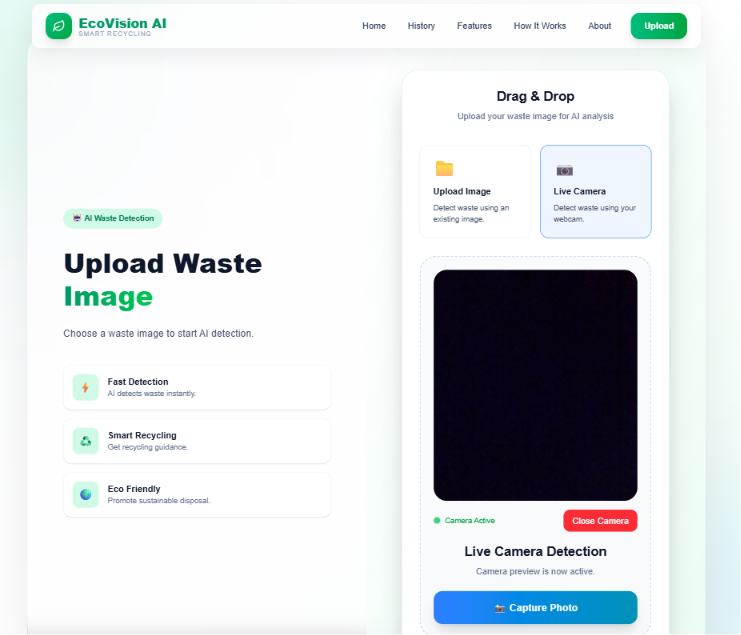

# 🌍 EcoVision AI

<div align="center">

# ♻️ AI-Powered Smart Waste Detection & Recycling Assistant

### Turning Waste into Smart Decisions with Artificial Intelligence


<br>


</div>

---

# 📖 About EcoVision AI

EcoVision AI is an **AI-powered Smart Waste Detection & Recycling Assistant** developed during a Hackathon to promote **clean and green technology**.

The application helps users identify waste materials using a **custom-trained YOLOv8 model** through either:

- 📁 Image Upload
- 📷 Live Camera Capture

After detection, EcoVision AI instantly provides:

- 🧠 Object Name
- ♻️ Waste Category
- 📈 Confidence Score
- ✅ Recyclable / ❌ Non-Recyclable
- 🗑 Correct Disposal Bin
- 📚 Recycling Instructions
- 💡 Creative Reuse Ideas
- 🌍 Environmental Impact

The goal is to encourage smarter waste segregation and sustainable recycling practices using Artificial Intelligence.

---

# 🎯 Problem Statement

Improper waste disposal is one of today's biggest environmental challenges.

Many people don't know:

- Which bin to use
- Whether an item is recyclable
- How to recycle correctly
- How improper disposal affects the environment

EcoVision AI solves this problem using AI-powered image recognition and recycling guidance.

---

# 🚀 Main Features

| Feature | Description |
|----------|-------------|
| 🤖 **AI Waste Detection** | Detects waste using a custom-trained YOLOv8 model. |
| 📁 **Image Upload Detection** | Upload JPG, JPEG or PNG images with drag & drop support. |
| 📷 **Live Camera Detection** | Capture images directly using the device camera with live preview and retake support. |
| 🧠 **AI Prediction** | Predicts object name, waste category and confidence score. |
| ♻️ **Recycling Guidance** | Shows recyclability, disposal bin, recycling instructions, reuse ideas and environmental impact. |
| 📜 **Detection History** | Stores previous detections with view and delete functionality. |
| 🖼 **Premium Result Modal** | Beautiful modal displaying captured image, AI prediction and recycling guidance. |
| 📱 **Responsive UI** | Fully responsive across Desktop, Laptop, Tablet and Mobile devices. |

---

# 🏗 Tech Stack

## 🎨 Frontend

| Technology | Purpose |
|------------|---------|
| React | UI Library |
| Vite | Frontend Build Tool |
| Tailwind CSS | Styling |
| Axios | API Communication |
| JavaScript | Frontend Programming |

---

## ⚙ Backend

| Technology | Purpose |
|------------|---------|
| Python | Programming Language |
| Django | Backend Framework |
| Django REST Framework | REST APIs |

---

## 🤖 Artificial Intelligence

| Technology | Purpose |
|------------|---------|
| YOLOv8 | Object Detection |
| Ultralytics | YOLO Framework |
| OpenCV | Image Processing |

---

## 🗄 Database

| Technology | Purpose |
|------------|---------|
| SQLite | Detection History Storage |

---

# ⚙ AI Workflow

```text
📁 Upload Image
        OR
📷 Live Camera

        │
        ▼

React Frontend

        │
        ▼

POST /api/detect/

        │
        ▼

Django REST Framework

        │
        ▼

YOLOv8 AI Model

        │
        ▼

Waste Prediction

        │
        ▼

Waste Mapping Service

        │
        ▼

Detection History Saved

        │
        ▼

Premium Result Modal Displayed
```

---

# 📂 Project Structure

```text
EcoVision-AI/
│
├── backend/
│   ├── apps/
│   │   ├── common/
│   │   ├── recycling/
│   │   ├── accounts/
│   │   └── waste_detection/
│   │       ├── ai/
│   │       │   ├── models/
│   │       │   ├── predictor.py
│   │       │   ├── detector.py
│   │       │   └── waste_mapper.py
│   │       ├── serializers.py
│   │       ├── services.py
│   │       ├── views.py
│   │       └── models.py
│   │
│   ├── config/
│   ├── media/
│   └── manage.py
│
├── frontend/
│   ├── src/
│   │   ├── assets/
│   │   ├── components/
│   │   ├── pages/
│   │   ├── services/
│   │   ├── api/
│   │   ├── App.jsx
│   │   └── main.jsx
│   │
│   ├── public/
│   └── package.json
│
├── README.md
└── requirements.txt
```

---

# 🌐 API Endpoints

| Method | Endpoint | Description |
|---------|----------|-------------|
| POST | `/api/detect/` | Detect waste from uploaded/captured image |
| GET | `/api/history/` | Fetch all detection history |
| GET | `/api/history/{id}/` | Fetch single detection details |
| DELETE | `/api/history/{id}/delete/` | Delete detection history |

---

# 💻 Installation

## Backend

### 1️⃣ Clone Repository

```bash
git clone https://github.com/your-username/EcoVision-AI.git
```

### 2️⃣ Navigate

```bash
cd EcoVision-AI
```

### 3️⃣ Create Virtual Environment

```bash
python -m venv .venv
```

### 4️⃣ Activate Environment

Windows

```bash
.venv\Scripts\activate
```

Linux / macOS

```bash
source .venv/bin/activate
```

### 5️⃣ Install Requirements

```bash
pip install -r requirements.txt
```

### 6️⃣ Apply Migrations

```bash
python manage.py migrate
```

### 7️⃣ Start Backend

```bash
python manage.py runserver
```

---

## Frontend

Navigate to frontend

```bash
cd frontend
```

Install Packages

```bash
npm install
```

Run Development Server

```bash
npm run dev
```

---

# 📸 Screenshots

| Home | Upload |
|------|--------|
|  |  |

---

| Live Camera | Detection Result |
|-------------|------------------|
|  |  |

---

| Detection History |
|-------------------|
|  |

---

# 🎥 Demo

## 🎬 Demo Video

> *(Add Demo Video Link Here)*

---

## 💻 GitHub Repository

> *(Add GitHub Repository Link Here)*

---

# 🔥 Challenges Faced

Developing EcoVision AI involved solving several real-world engineering challenges:

- 🔗 Integrating React with Django REST Framework
- 🤖 Connecting the YOLOv8 prediction pipeline
- 📷 Implementing live webcam capture
- 📁 Handling image uploads efficiently
- 🗂 Managing temporary media files
- 📜 Building detection history
- 🧠 Mapping AI predictions into meaningful recycling guidance
- 📱 Designing a fully responsive UI
- 🖼 Building a reusable premium detection modal
- 🔐 Handling browser camera permissions
- 🔄 Frontend and backend integration
- 🚀 Preparing the project for GitHub and deployment

---

# ✨ Future Improvements

- 🌙 Dark Mode
- 🌐 Multi-language Support
- 🎥 Real-time Video Detection
- ☁ Cloud Deployment
- 👤 User Authentication
- 📍 GPS-based Recycling Centers
- 🤖 AI Recycling Chat Assistant
- 📊 Analytics Dashboard

---

# 👨‍💻 Team

Developed during a Hackathon.

| Member | Role |
|--------|------|
| Your Name | Full Stack Developer |
| Member 2 | AI Engineer |
| Member 3 | Frontend Developer |

---

# 📄 License

This project is licensed under the **MIT License**.

---

# ❤️ Acknowledgements

Special thanks to the amazing open-source community and technologies that made this project possible.

- ⚛ React
- 🎨 Tailwind CSS
- 🐍 Python
- 🌿 Django
- 🚀 Django REST Framework
- 🤖 Ultralytics YOLOv8
- 👁 OpenCV
- 💻 Vite
- 🌍 Open Source Community
- 🏆 Hackathon Organizers

---

<div align="center">

## 🌱 Building a Cleaner Planet with Artificial Intelligence ♻️

### ⭐ If you found this project useful, please consider giving it a Star!

**Made with ❤️ during a Hackathon**

</div>
